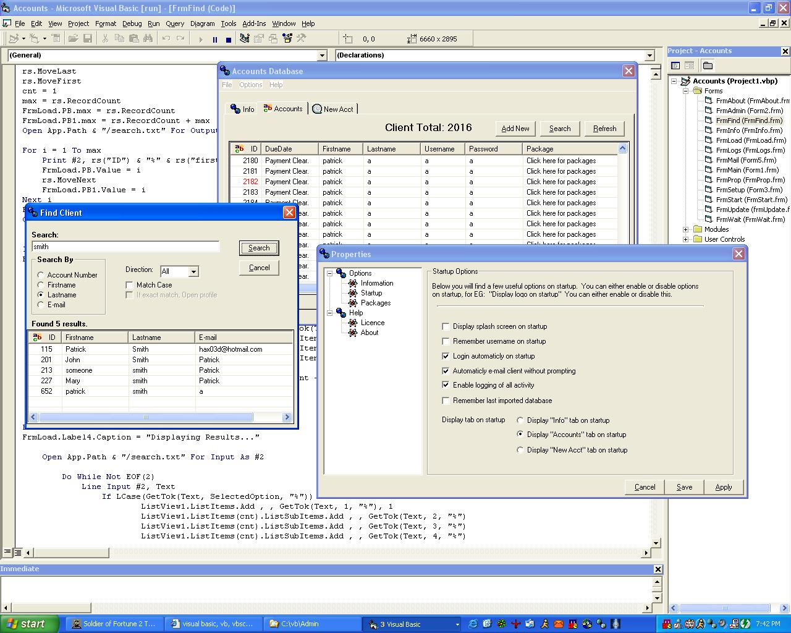



## Accounts Database 2\.8

### Description

Keep track of all clients registered in your company. If they have a payment comming up the program will automaticly e-mail them. Has many many fetures. Search options, properties. Also used to help from someone here for the updates form and the e-mail, and i thank you!!. Uses DAO database. Any further questions just send feedback. I will be e-mailed any feedback posted

I sure hope you people le arn something from this program or like it, one or the other. Because this has taken some time to do.
 
### More Info
 

             |
---                |---
**Submitted On**   |2002-04-21 19:42:58
**By**             |[Patrick G](https://github.com/Planet-Source-Code/PSCIndex/blob/master/ByAuthor/patrick-g.md)
**Level**          |Advanced
**User Rating**    |4.8 (86 globes from 18 users)
**Compatibility**  |VB 6\.0
**Category**       |[Complete Applications](https://github.com/Planet-Source-Code/PSCIndex/blob/master/ByCategory/complete-applications__1-27.md)
**World**          |[Visual Basic](https://github.com/Planet-Source-Code/PSCIndex/blob/master/ByWorld/visual-basic.md)
**Archive File**   |[Accounts\_D743414212002\.zip](https://github.com/Planet-Source-Code/patrick-g-accounts-database-2-8__1-34017/archive/master.zip)

